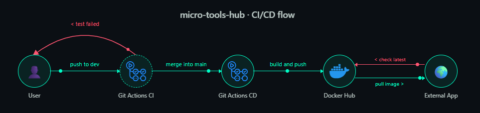

# 🧰 micro-tools-hub


A personal hub of small backend APIs. Each mini-app is a self-contained FastAPI service, scaffolded from the same [Cookiecutter](https://github.com/cookiecutter/cookiecutter) template, tested and linted the same way, and shipped to Docker Hub the same way — no shared runtime, no coordination between apps, no manual release step.

Browse `apps/` to see what tools exist and pull the image you need.

## 🔁 How a change ships



- Write commits with a [Conventional Commit](https://www.conventionalcommits.org/) prefix (`fix`, `feat`, `feat!`) — that's the only signal the pipeline needs.
- Open the PR into `main`: CI lints and tests the apps you touched, then bumps their `version` in `manifest.json` automatically (patch/minor/major from your commits — see `versioning/`).
- Merge: the image is built, checked for size, and pushed to Docker Hub tagged `latest` and with that exact version. That's the whole release loop.


## 📁 Structure

```
apps/
  template/        # cookiecutter scaffold for a new mini-app (not a real app)
  <app-name>/       # one folder per mini-app, all structured the same way
    main.py
    manifest.json   # name, version, docker_repo, endpoint, tags
    Dockerfile
    pyproject.toml
    tests/
versioning/          # auto-bumps each app's version from its commits (see above)
spec/                 # planning docs (constitution + feature specs)
```

## ➕ Add a new app

```bash
cd apps
uvx cookiecutter ./template
```

Fill in the generated `manifest.json`, write your endpoint logic in `main.py`, then open a PR to `dev`. See [`docs/colaboration.md`](docs/colaboration.md) for the full contributor workflow.

## 🌿 Branching

Work happens on `dev`; `main` reflects what's been released. See `spec/constitution/` for the full rationale and `spec/features/` for what's planned per version.
